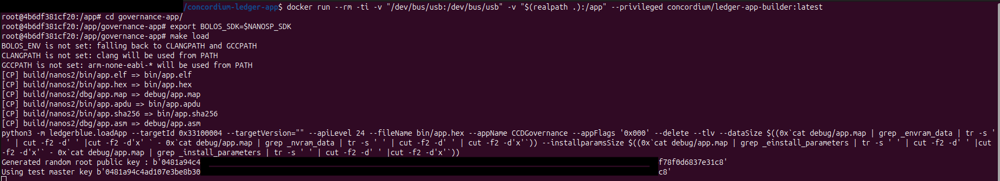

# Concordium Governance Ledger application

An application for the Ledger Nano S and Ledger Nano S Plus devices for retrieving keys and signing update transactions.

It is built the same way as the main app, expect that you need to be in this folder instead.

Tests for this app can be found in the main test folders, under the governance subfolder.

## Building the Governance Ledger App

Ensure you are in the repository root (not inside the `governance-app` folder) and that the Docker image has been built as described in the [main app](../README.md). 
Although the full build process is covered in the [main app](../README.md), an example screenshot is included below for clarity. 
Especially to highlight that you need to navigate into this `governance-app` folder inside the docker image.

 

